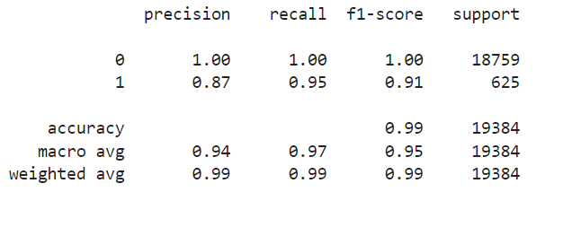

# credit-risk-classification

## Objective 

Apply various techniques to train and evaluate a model based on loan risk using a dataset of historical lending activity from a peer-to-peer lending services company to build a model that can identify the creditworthiness of borrowers.

## Instructions

1. Split the Data into Training and Testing Sets

2. Create a Logistic Regression Model with the Original Data

3. Write a Credit Risk Analysis Report

## Results

How well does the logistic regression model predict both the 0 (healthy loan) and 1 (high-risk loan) labels?

Classification Report

Write a Credit Risk Analysis Report:  Write a brief report that includes a summary and analysis of the performance of the machine learning models that you used in this homework. You should write this report as the README.md file included in your GitHub repository. Structure your report by using the report template that Starter_Code.zip

The results: Using a bulleted list, describe the accuracy score, the precision score, and recall score of the machine learning model.

## Summary

A summary: Summarize the results from the machine learning model. Include your justification for recommending the model for use by the company. If you don’t recommend the model, justify your reasoning.
